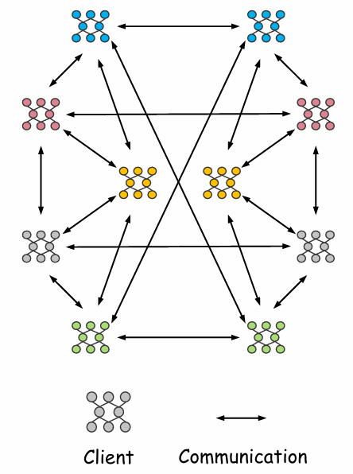

# DecFus

Code for **DecFus: Decentralized Layer-wise Fusion with Dynamic Exploration and Exploitation** (ICML 2026).

Most Decentralized Federated Learning (DFL) methods rely on parameter averaging, which explores the loss landscape insufficiently, while exchanging layers among clients explores more but makes training unstable. **Decentralized Layer-wise Fusion (DecFus)** unifies layer-level exchange (exploration) and averaging (exploitation), and dynamically moves training from an exploration-dominant phase to an exploitation-dominant phase, guided by the loss variance among connected neighbors.

## How it works

DecFus consists of three components: a Dynamic Cutoff Determination module that decides the proportions of the two layer groups, a Similarity-based Layer Grouping method that partitions the layers, and a Unified Layer-wise Aggregation mechanism that fuses layer exchange and averaging. After local training, each client executes:

- **Dynamic Cutoff Determination.** Each client dynamically computes a cutoff that determines the group sizes of layer exchange and averaging. The cutoff starts from a value that encourages layer exchange and moves toward a value that favors averaging, triggered by the training loss variance among connected neighbors.
- **Similarity-based Layer Grouping.** The client computes the pairwise cosine similarity of layers with its neighbors to obtain a similarity score for each layer. Using the dynamic cutoff over these scores, it assigns layers with high similarity scores to the averaging group and those with low similarity scores to the exchange group.
- **Unified Layer-wise Aggregation.** Each group is aggregated with its own strategy: layers in the averaging group perform weighted averaging, while layers in the exchange group undergo probabilistic exchange. Both strategies are integrated into a single layer-wise aggregation formula.

## Installation

Python 3.8 or later.

```bash
pip install torch torchvision numpy swanlab
```

Metrics are logged with [SwanLab](https://docs.swanlab.cn/en/). 

## Quick start

```bash
python main_fed.py --algorithm DecFus --dataset cifar10 --model resnet50 --epochs 1000 --local_bs 64 --iid 0 --data_beta 0.5
```

Datasets are downloaded automatically to `./data` on first use. Add `--gpu -1` to run on CPU.

### Algorithms

| `--algorithm` | Method |
|---|---|
| `DecFus` | DecFus (this paper) |
| `DFLAvg` | Decentralized federated averaging |
| `DFLMR` | Decentralized extension of FedMR (layer-wise model recombination) |
| `FedAvg` | Centralized FedAvg |

### Datasets and models

| `--dataset` | Dataset |
|---|---|
| `cifar10` | CIFAR-10 |
| `cifar100` | CIFAR-100 with the 20 coarse (superclass) labels |
| `svhn` | SVHN |

| `--model` | Network |
|---|---|
| `resnet50` | ResNet-50 |
| `vgg` | VGG16  |

### Data heterogeneity

- IID: `--iid 1`
- Non-IID: `--iid 0 --data_beta <alpha>` splits the data with a Dirichlet distribution `Dir(alpha)`; a smaller `alpha` means stronger heterogeneity. The paper uses 0.1, 0.5 and 1.0.


### Communication topology

The decentralized algorithms use a fixed topology of 10 clients in which every client has 4 neighbors, so `--num_users` must stay at 10.

<p align="center">
  
</p>


## Settings used

All methods use SGD with learning rate 0.01, momentum 0.5, 3 local epochs and 10 clients.

| Dataset | `--epochs` | `--local_bs` |
|---|---|---|
| CIFAR-10, CIFAR-100 | 1000 | 64 |
| SVHN | 500 | 128 |

```bash
# CIFAR-10, ResNet-50, Dir(0.1)
python main_fed.py --algorithm DecFus --dataset cifar10 --model resnet50 --epochs 1000 --local_bs 64 \
    --iid 0 --data_beta 0.1

# CIFAR-100, VGG16, IID
python main_fed.py --algorithm DecFus --dataset cifar100 --num_classes 20 --model vgg --epochs 1000 --local_bs 64 \
    --iid 1 

# SVHN, VGG16, Dir(1.0)
python main_fed.py --algorithm DecFus --dataset svhn --model vgg --epochs 500 --local_bs 128 \
    --iid 0 --data_beta 1.0

# Baselines: same command with another algorithm
python main_fed.py --algorithm DFLAvg --dataset cifar10 --model resnet50 --epochs 1000 --local_bs 64 --iid 0 --data_beta 0.1
```

## Citation

```bibtex
@inproceedings{yang2026decfus,
    title     = {DecFus: Decentralized Layer-wise Fusion with Dynamic Exploration and Exploitation},
    author    = {Yang, Li and Sun, Jialong and Cai, Chuhai and Liu, Xinyang and Li, Yichen and Peng, Bowen and Li, Jialong and Liu, Bo},
    booktitle = {Proceedings of the 43rd International Conference on Machine Learning},
    publisher = {PMLR},
    year      = {2026}
}
```

## Acknowledgements

This code is built on [FedMR](https://github.com/HMHelloWorld/FedMR) (MIT License).
## License

Released under the [Apache License 2.0](LICENSE).
